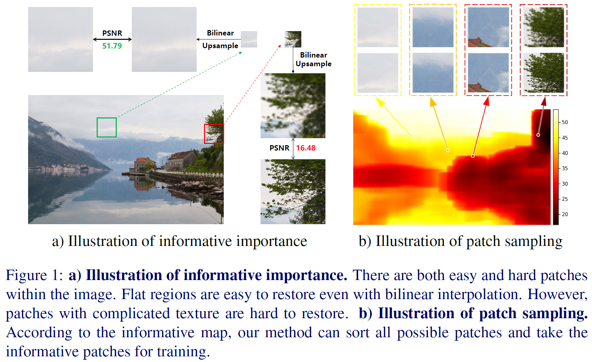

# SamplingAug


This repository holds the official PyTorch implementation of the paper **"SamplingAug: On the Importance of Patch Sampling Augmentation for Single Image Super-Resolution"**.

> [SamplingAug: On the Importance of Patch Sampling Augmentation for Single Image Super-Resolution](https://arxiv.org/abs/2111.15185)   
> Shizun Wang, Ming Lu, Kaixin Chen, Jiaming Liu, Xiaoqi Li, Chuang zhang, Ming Wu    
> BMVC 2021 [[paper]](https://arxiv.org/abs/2111.15185) [[supp]](https://www.bmvc2021-virtualconference.com/assets/supp/0387_supp.zip)




## Abstract
With the development of Deep Neural Networks (DNNs), plenty of methods based on DNNs have been proposed for Single Image Super-Resolution (SISR). However, existing methods mostly train the DNNs on uniformly sampled LR-HR patch pairs, which makes them fail to fully exploit informative patches within the image. In this paper, we present a simple yet effective data augmentation method. We first devise a heuristic metric to evaluate the informative importance of each patch pair. In order to reduce the computational cost for all patch pairs, we further propose to optimize the calculation of our metric by integral image, achieving about two orders of magnitude speedup. The training patch pairs are sampled according to their informative importance with our method. Extensive experiments show our sampling augmentation can consistently improve the convergence and boost the performance of various SISR architectures, including EDSR, RCAN, RDN, SRCNN and ESPCN across different scaling factors (x2, x3, x4).


## Installation
* Python 3.6
* PyTorch >= 1.2.0
* numpy
* numba
* skimage
* imageio
* matplotlib
* tqdm
* cv2

## Usage

### Dataset preparation

We use [DIV2K](http://www.vision.ee.ethz.ch/%7Etimofter/publications/Agustsson-CVPRW-2017.pdf) dataset to train models. You can download it from [here](https://cv.snu.ac.kr/research/EDSR/DIV2K.tar) (7.1GB).   

We evaluate models on benchmarks: 
[Set5](http://people.rennes.inria.fr/Aline.Roumy/results/SR_BMVC12.html),
[Set14](https://sites.google.com/site/romanzeyde/research-interests),
[B100](https://www2.eecs.berkeley.edu/Research/Projects/CS/vision/bsds/),
[Urban100](https://sites.google.com/site/jbhuang0604/publications/struct_sr).
You can download them from [here](https://cv.snu.ac.kr/research/EDSR/benchmark.tar) (250MB).

Unpack the dataset files to any place you want. Then, change the ```--dir_data <dataset_dir>``` argument to the directory where datasets are located. The data structure looks like below:
```
<dataset_dir>
├── DIV2K
├── benchmark
│   ├── Set5
│   ├── Set14
│   ├── B100
│   ├── Urban100
```

### Data preprocess

1. Generate binaries    
We pre-process the images before training. This step will decode all **png** files and save them as binaries. 
```bash
python preprocess/create_bin.py --dir_data <dataset_dir>
```


2. Generate metric list by informative importance (greedy sampling)     
Then we calculate informative importance (II) of each patch in the dataset and generate an index list sorted by II (ascending). Index is the (u,v)th patch (u - y axis, v - x axis). Low II indicates difficult samples, which is more worth training
```bash
python preprocess/create_bin_ii.py --dir_data <dataset_dir>
```

3. (Optional) Generate metric list by informative importance (throwing darts sampling)     
generate an index list sorted by II (ascending) with throwing darts sampling.
```bash
python preprocess/create_bin_ii_darts.py --dir_data <dataset_dir>
```

4. (Optional) Generate metric list by informative importance (NMS sampling)     
generate an index list sorted by II (ascending) with NMS sampling.
```bash
python preprocess/create_bin_ii_nms.py --dir_data <dataset_dir>
```

## Training and Testing

```bash
# train EDSR normally
python main.py --template EDSR_baseline
# train EDSR using SamplingAug
python main.py --template EDSR_sa
# test EDSR on benchmarks
python main.py --template EDSR_test
```


There are lots of training and testing templates in `template.py`, run them by command:
```python
python main.py --template xxx
```
And the args explaination is in the `options.py`.


* For normal training,   
`--data_train` is set to `DIV2K` by default.

* For SamplingAug training,   
`--data_train` should be set to `DIV2K_SA`.    
Meanwhile `--data_portion` should be specified a portion (e.g. 0.1).    
And `--file_suffix` also should be set for the retrieval of index list files, different files represents different metrics or different sampling strategies (e.g. `_psnr_up_new.pt`, `_std0_rgb_p192_new.pt`, `_psnr_nms_1000.pt`, `_psnr_darts.pt`).

* For test,   
`--test_only` can be set true, and if GPU memory is not enough, `args.chop` can be activated for memory-efficient forwarding.


## Citation
```
@inproceedings{wang2021samplingaug,
  title={SamplingAug: On the Importance of Patch Sampling Augmentation for Single Image Super-Resolution},
  author={Wang, Shizun and Lu, Ming and Chen, Kaixin and Liu, Jiaming and Li, Xiaoqi and Zhang, chuang and Wu, Ming},
  booktitle={BMVC},
  year={2021}
}
```


## Acknowledgements
This code is built on [EDSR](https://github.com/sanghyun-son/EDSR-PyTorch) codebase. We thank the authors for sharing the codes.